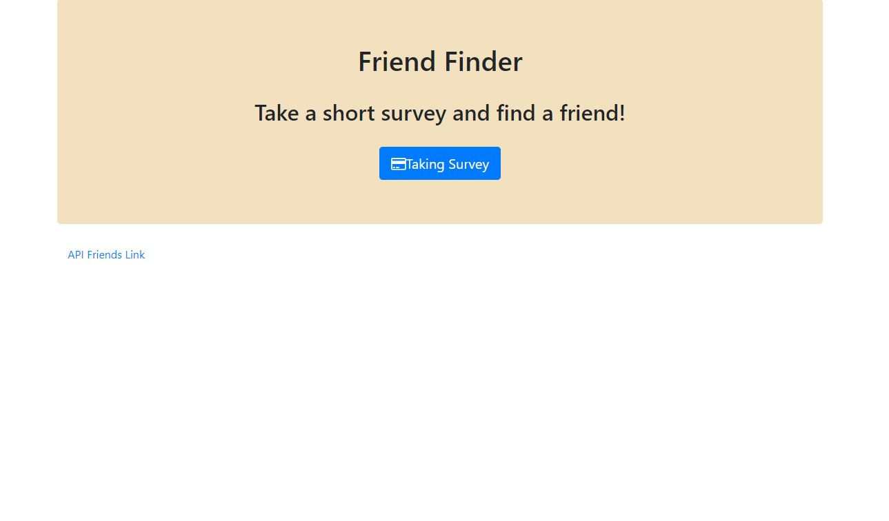
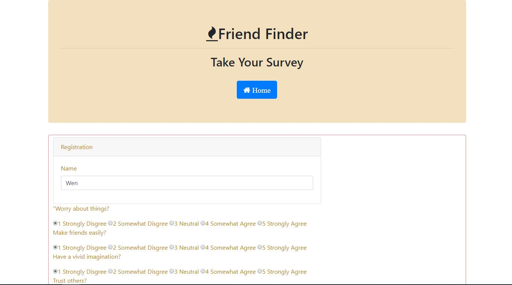
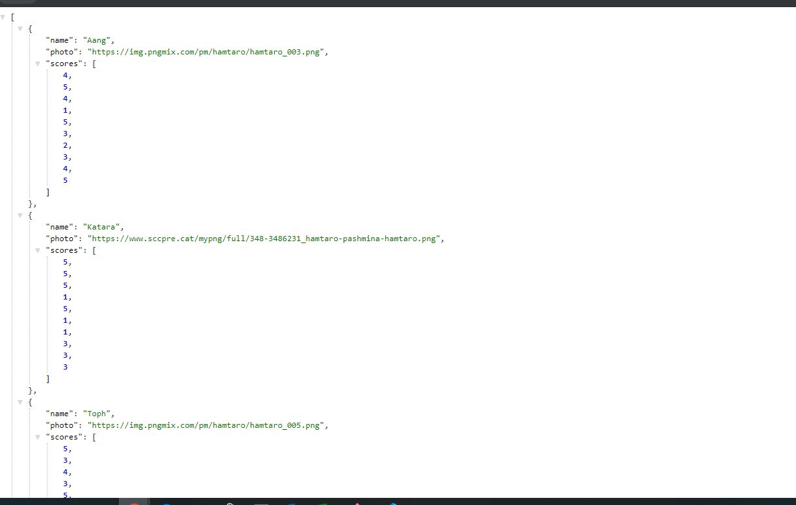
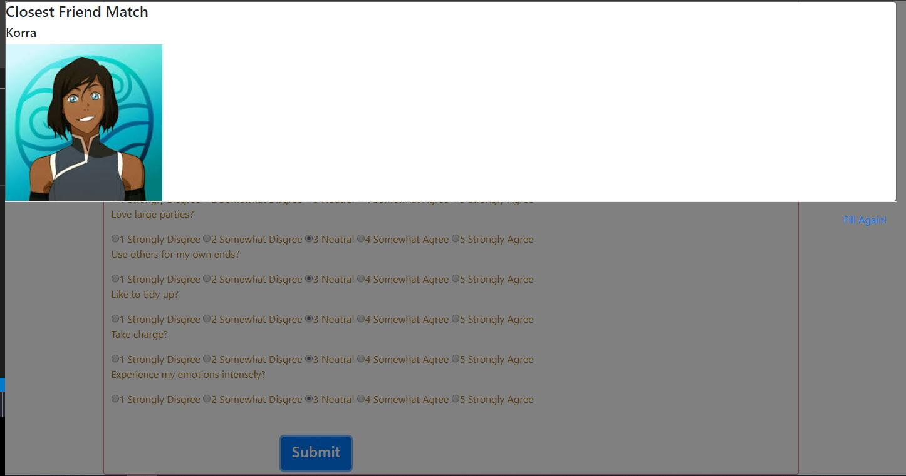

# Friend Finder - Node and Express Servers

### Overview

In this activity, you'll build a compatibility-based "FriendFinder" application -- basically a dating app. This full-stack site will take in results from your users' surveys, then compare their answers with those from other users. The app will then display the name and picture of the user with the best overall match.

You will use Express to handle routing. Make sure you deploy your app to Heroku so other users can fill it out.


### Instructions

1. I will provide survey with 10 questions. Each answer will have scale of 1 to 5 based on how much the user agrees or disagrees with a question.

2. My `server.js` file should require the basic npm packages we've used in class: `express` and `path`.

3. My `htmlRoutes.js` file should include two routes:

   * A GET Route to `/survey` which should display the survey page.
   * A default, catch-all route that leads to `home.html` which displays the home page.

4. My `apiRoutes.js` file should contain two routes:

   * A GET route with the url `/api/friends`. This will be used to display a JSON of all possible friends.
   * A POST routes `/api/friends`. This will be used to handle incoming survey results. This route will also be used to handle the compatibility logic.

5. I have `app/data/friends.js` as an array of objects. Each of these objects should roughly follow the format below.

```json
{
  "name":"Ahmed",
  "photo":"https://media.licdn.com/mpr/mpr/shrinknp_400_400/p/6/005/064/1bd/3435aa3.jpg",
  "scores":[
      5,
      1,
      4,
      4,
      5,
      1,
      2,
      5,
      4,
      1
    ]
}
```

6. ApiRoutes witll determine the user's most compatible friend using the following as a guide:

   * Convert each user's results into a simple array of numbers (ex: `[5, 1, 4, 4, 5, 1, 2, 5, 4, 1]`).
   * With that done, compare the difference between current user's scores against those from other users, question by 





